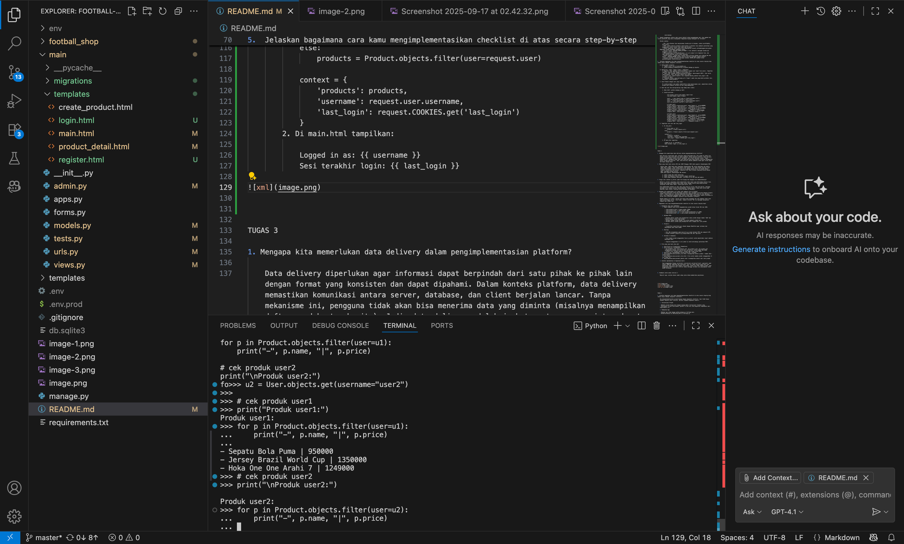
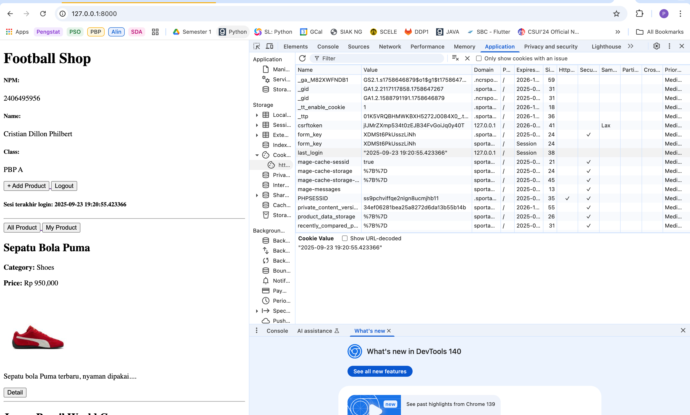
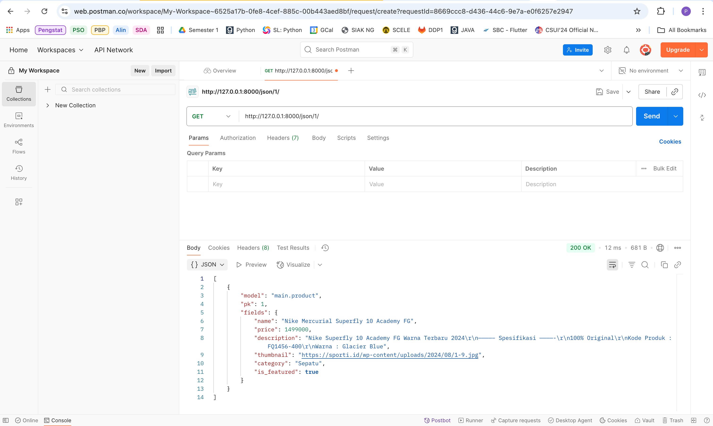

Tugas 5

1. Jika terdapat beberapa CSS selector untuk suatu elemen HTML, jelaskan urutan prioritas pengambilan CSS selector tersebut!

    Urutan prioritas (specificity) CSS selector adalah:

    - Inline style (misal: 
) — paling tinggi.
    - ID selector (misal: #header).
    - Class, attribute, dan pseudo-class selector (misal: .menu, [type="text"], :hover).
    - Element dan pseudo-element selector (misal: div, h1, ::after).
    - Urutan kemunculan: Jika dua selector memiliki tingkat specificity yang sama, maka yang muncul terakhir di CSS akan diterapkan.

2. Mengapa responsive design menjadi konsep yang penting dalam pengembangan aplikasi web? Berikan contoh aplikasi yang sudah dan belum menerapkan responsive design, serta jelaskan mengapa!

    1. Responsive design penting karena:
        - Memastikan tampilan web tetap baik di berbagai perangkat (desktop, tablet, mobile).
        - Meningkatkan pengalaman pengguna (user experience).
        - SEO lebih baik (Google memprioritaskan mobile-friendly site).

    2. Contoh aplikasi:

        - Sudah responsive: Instagram, Tokopedia, Shopee (tampilan menyesuaikan layar).
        - Belum responsive: Website lama yang hanya optimal di desktop, misal situs pemerintah lama yang harus di-scroll secara horizontal di HP.

3. Jelaskan perbedaan antara margin, border, dan padding, serta cara untuk mengimplementasikan ketiga hal tersebut!
  
    - Margin: Jarak luar elemen ke elemen lain.
    - Border: Garis tepi elemen.
    - Padding: Jarak antara border dan isi elemen.

4. Jelaskan konsep flex box dan grid layout beserta kegunaannya!

    1. Flexbox: Layout satu dimensi (baris/kolom), memudahkan align dan distribusi ruang antar item dalam container.
    .flex-container {
    display: flex;
    justify-content: space-between;
    align-items: center;
    }
    Kegunaan: Navbar, card horizontal, centering.

    2. Grid: Layout dua dimensi (baris & kolom), cocok untuk desain kompleks seperti galeri.
    .grid-container {
    display: grid;
    grid-template-columns: repeat(3, 1fr);
    gap: 16px;
    }
    Kegunaan: Galeri foto, dashboard, layout majalah.

5. elaskan bagaimana cara kamu mengimplementasikan checklist di atas secara step-by-step (bukan hanya sekadar mengikuti tutorial)!

    1. Setup & Styling
        - Menambahkan Tailwind melalui CDN dan global.css untuk gaya form custom.
        - Mengubah skema warna dari hijau ke hitam/abu-abu untuk tampilan yang bersih dan tegas.

    2. Product CRUD
        - create_product: menetapkan product.user = request.user.
        - edit_product & delete_product: dibatasi hanya untuk pemilik produk.

    3. Templates

        - navbar.html: navigasi responsif dengan menu desktop + mobile.
        - card_product.html: kartu produk didesain ulang dengan gambar yang bisa diklik, info produk, harga, dan tombol inline.

    4. Responsive Layout

        - Menggunakan utility grid Tailwind untuk daftar produk.
        - Tombol dan form diberi gaya dengan spacing konsisten dan efek hover.

    5. Ownership Fix

        - Memastikan aksi produk hanya dapat dilakukan oleh pemilik produk.

TUGAS 4
1. Apa itu AuthenticationForm di Django? Kelebihan & kekurangannya
    AuthenticationForm adalah form bawaan Django (django.contrib.auth.forms.AuthenticationForm) yang menyediakan field untuk login (biasanya username dan password) dan fungsi validasi terkait autentikasi user
    
    Kelebihan

        1. Langsung pakai (bawaan), sudah menangani banyak detail validasi (cek kredensial, inactive user via confirm_login_allowed).
        2. Terintegrasi dengan backend auth Django sehingga aman dan konsisten
        3. Memiliki method get_user() sehingga memudahkan proses login().
        4. Menghasilkan pesan error/validasi yang rapi tanpa harus menulis validasi manual.

    Kekurangan 

        1. Field default adalah username — kalau sistemmu pakai email sebagai login perlu kustomisasi atau form kustom.
        2. Tidak menyediakan fitur lanjutan (2FA, social auth, OTP) — harus integrasi paket lain.
        3. Tampilan (HTML) perlu disediakan di template; kalau ingin UI sangat berbeda biasanya buat custom form.
        4. AuthenticationForm hanya memvalidasi kredensial — proses login() (set session, cookie) tetap harus dilakukan secara eksplisit.
2. Apa perbedaan antara autentikasi dan otorisasi? Bagaiamana Django mengimplementasikan kedua konsep tersebut?

    Autentikasi
       - Menjawab identitas pengguna (login), biasanya dengan username/password.

       - Django: django.contrib.auth.authenticate() untuk verifikasi kredensial, django.contrib.auth.login() menyimpan info session. Model User menyimpan data akun (username, password (hash), email, is_active, last_login, dll).
    
    Otorisasi
        - Menangani hak akses: apakah user boleh mengakses halaman/aksi/objek tertentu.
        - Django: sistem permission & group (user.has_perm('app_label.codename'), @permission_required, user.is_staff, user.is_superuser).

3. Apa saja kelebihan dan kekurangan session dan cookies dalam konteks menyimpan state di aplikasi web?

    Cookies (client-side)
        Kelebihan:

            - Tidak memerlukan penyimpanan server (stateless).
            - Persisten (bisa bertahan setelah browser ditutup).
            - Mudah dipakai untuk preference kecil.

        Kekurangan:

            - Ukuran terbatas (~4KB).
            - Rentan terhadap pencurian lewat XSS kalau tidak diberi HttpOnly.
            - Bisa dimanipulasi jika tidak ditandatangani/terenkripsi.
            - Tidak cocok menyimpan data sensitif (mis. session user) tanpa proteksi.
    
    Sessions (server-side)
            Kelebihan:

            - Data sensitif tetap di server → lebih aman dari manipulasi.
            - Bisa simpan lebih banyak data tanpa terikat limit cookie.
            - Mudah di-revoke (hapus sesi di server).

            Kekurangan:

            - Membutuhkan penyimpanan server (DB/Redis) → beban & skalabilitas perlu dipikirkan.
            - Perlu mekanisme shared session store atau sticky sessions di arsitektur distributed.

4.  Apakah penggunaan cookies aman secara default dalam pengembangan web, atau apakah ada risiko potensial yang harus diwaspadai? Bagaimana Django menangani hal tersebut?

    Risiko cookies

        - XSS: jika attacker bisa menjalankan JavaScript di halaman, cookie non-HttpOnly bisa dicuri.
        - CSRF: cookie dikirim otomatis oleh browser → attacker bisa membuat permintaan yang menggunakan cookie korban jika tidak ada proteksi.
        - Cookie tampering: data cookie bisa dimanipulasi kecuali ditandatangani/encrypted
    Bagaimana Django menangani keamanan cookie
        - Session cookie: SESSION_COOKIE_HTTPONLY = True (default) mencegah JavaScript mengakses cookie session.
        - CSRF protection: CsrfViewMiddleware +  di template form, dan CSRF_TRUSTED_ORIGINS untuk origin checking.
        - Signed cookies / signed data: Django punya utilitas django.core.signing dan ada option - SESSION_ENGINE='django.contrib.sessions.backends.signed_cookies'.
        - Password hashing: password disimpan hashed; SECRET_KEY dipakai untuk penandatanganan cookie/sessions.

5.  Jelaskan bagaimana cara kamu mengimplementasikan checklist di atas secara step-by-step (bukan hanya sekadar mengikuti tutorial).

    A. Setup model & migrasi
        1. Tambah relasi user di main/models.py
        2. python manage.py makemigrations & python manage.py migrate.

    B. Registrasi, Login, Logout (views + templates)
        1. Register view: gunakan UserCreationForm. Simpan user lewat form.save(). Tampilkan template register.html dengan .
        2. Login view: gunakan AuthenticationForm(request, data=request.POST). Jika valid, login(request, user) dan buat cookie last_login:
        3. Logout view: logout(request) lalu response.delete_cookie('last_login') dan redirect ke login.
        4. Tambahkan @login_required(login_url='/login') pada view yang butuh proteksi (mis. show_main, create_product).

    C. Save Product dengan user yang login

        Di create_product view pakai commit=False untuk menyisipkan user, memastikan setiap produk baru otomatis tertaut ke user yang membuatnya.

    D. Buat dua user dan masing-masing tiga dummy data (lokal)

        1. Buka shell: python manage.py shell

        2. Contoh perintah :

                from django.contrib.auth.models import User
                from main.models import Product

                user1, _ = User.objects.get_or_create(username='user1')
                user1.set_password('user123'); user1.save()
                user2, _ = User.objects.get_or_create(username='user2')
                user2.set_password('user123'); user2.save()

                # Produk user1
                Product.objects.create(user=user1, name='Sepatu A', price=400000, category='Shoes', description='...', thumbnail='https://...')
                Product.objects.create(user=user1, name='Jersey A', price=300000, category='Jersey', description='...', thumbnail='https://...')
                Product.objects.create(user=user1, name='Bola A', price=150000, category='Ball', description='...', thumbnail='https://...')

                # Produk user2
                Product.objects.create(user=user2, name='Sepatu B', price=450000, category='Shoes', description='...', thumbnail='https://...')
                Product.objects.create(user=user2, name='Jersey B', price=320000, category='Jersey', description='...', thumbnail='https://...')
                Product.objects.create(user=user2, name='Bola B', price=180000, category='Ball', description='...', thumbnail='https://...')

    E. Tampilkan info user dan last_login

        1. Di show_main:

            if filter_type == 'all':
                products = Product.objects.all()
            else:
                products = Product.objects.filter(user=request.user)

            context = {
                'products': products,
                'username': request.user.username,
                'last_login': request.COOKIES.get('last_login')
            }
        2. Di main.html tampilkan:

            Logged in as: {{ username }}
            Sesi terakhir login: {{ last_login }}

TUGAS 3

1. Mengapa kita memerlukan data delivery dalam pengimplementasian platform?

    Data delivery diperlukan agar informasi dapat berpindah dari satu pihak ke pihak lain dengan format yang konsisten dan dapat dipahami. Dalam konteks platform, data delivery memastikan komunikasi antara server, database, dan client berjalan lancar. Tanpa mekanisme ini, pengguna tidak akan bisa menerima data yang diminta (misalnya menampilkan daftar produk atau berita). Jadi, data delivery adalah jembatan utama agar sistem dapat berfungsi dengan baik.

2. Mana yang lebih baik antara XML dan JSON? Mengapa JSON lebih populer dibandingkan XML?
     
     Secara umum, JSON lebih baik digunakan dibandingkan XML untuk kebutuhan web modern. JSON lebih ringkas, lebih mudah dibaca oleh manusia, dan lebih mudah diproses oleh bahasa pemrograman karena strukturnya mirip dengan object/array di banyak bahasa (seperti JavaScript dan Python). Sementara XML lebih verbose (panjang karena banyak tag), sehingga kurang efisien.
     JSON lebih populer dibandingkan XML karena:

        1. Lebih ringan dan cepat diparsing.
        2. Sudah terintegrasi secara natural dengan JavaScript.
        3. Lebih mudah dipahami developer, terutama di era API dan web modern.

3. Fungsi dari method is_valid() pada form Django dan mengapa kita membutuhkannya?

    Method is_valid() digunakan untuk memvalidasi data input yang dikirimkan melalui form. Django akan memeriksa apakah data sudah sesuai dengan aturan yang didefinisikan (misalnya format email benar, field wajib diisi, dll).

    Kita membutuhkan method ini agar data yang masuk ke server aman dan bersih, sehingga mencegah error maupun potensi penyalahgunaan. Dengan begitu, hanya data valid yang diproses lebih lanjut, misalnya untuk disimpan ke database.

4. Mengapa kita membutuhkan csrf_token saat membuat form di Django?
    csrf_token diperlukan untuk melindungi aplikasi dari serangan Cross-Site Request Forgery (CSRF). Tanpa token ini, seorang penyerang bisa membuat form palsu di luar aplikasi kita, lalu mengarahkan pengguna agar secara tidak sadar mengirimkan request berbahaya ke server kita (misalnya mengganti password atau melakukan transaksi).

    Dengan adanya csrf_token, setiap form hanya akan dianggap sah jika membawa token unik yang cocok dengan server. Jika tidak, request ditolak. Hal ini mencegah manipulasi request dari pihak luar.

5. Bagaimana cara saya mengimplementasikan checklist di atas secara step-by-step?

    1. Ringkasan yang saya tambahkan:
        1. Empat endpoint data untuk mengembalikan produk dalam format XML dan JSON:

            ~ /api/products/json/ → semua produk (JSON)
            ~ /api/products/xml/ → semua produk (XML)
            ~ /api/products/json/<id>/ → satu produk berdasarkan id (JSON)
            ~ /api/products/xml/<id>/ → satu produk berdasarkan id (XML)

        2. Halaman HTML:

            ~ Halaman daftar produk yang menampilkan semua produk dengan tombol "Add" dan "tautan Detail" untuk tiap produk.
            ~ Halaman tambah produk dengan form untuk membuat produk baru.
            ~ Halaman detail produk yang menampilkan data lengkap dari satu produk.

        3. Formulir:

            ~ ProductForm (main/forms.py) dibuat dengan ModelForm agar validasi dan penyimpanan data lebih mudah.

        4. Routing:

            ~ Pola URL ditambahkan pada main/urls.py untuk halaman HTML dan endpoint API.
            ~ Proyek football_shop/urls.py menyertakan URL dari app main.

        5. Validasi & keamanan:

            ~ Form tambah produk menggunakan form.is_valid() untuk memvalidasi input sebelum menyimpan data.

            ~ Template menggunakan  untuk melindungi permintaan POST.

    2. File yang saya buat atau edit

        1. main/forms.py — ProductForm (ModelForm)
        2. main/views.py — ditambahkan:
            - api_products_json, api_products_xml, api_product_json, api_product_xml (menggunakan django.core.serializers.serialize() untuk output XML/JSON)
            - product_list, product_detail, product_add (views untuk HTML)
        3. main/urls.py — ditambahkan routing untuk API + halaman
        4. main/templates/main/product_list.html — menampilkan daftar produk + tombol Add + tautan Detail
        5. main/templates/main/product_form.html — form untuk tambah produk (menggunakan )
        6. main/templates/main/product_detail.html — menampilkan detail dari satu produk

    3. Catatan implementasi & keputusan kecil:

        Saya menggunakan Django serializers (serializers.serialize("json", queryset)) agar output JSON/XML sederhana dan konsisten. Cara ini cepat untuk proyek kecil dan memastikan nama field sama dengan field model. Untuk form HTML tambah produk, saya menggunakan ModelForm dari tutorial kedua sehingga validasi dan penyimpanan lebih mudah dilakukan.

6. Feedback untuk asdos tutorial 2
    
    Menurut saya, asisten dosen sudah cukup jelas dalam memberikan penjelasan.

TUGAS 2

1. Jelaskan bagaimana cara kamu mengimplementasikan checklist di atas secara step-by-step (bukan hanya sekadar mengikuti tutorial)?

    Aku mengimplementasikan proyek Django dengan mengikuti checklist, tapi tidak hanya sekadar menyalin dari tutorial. Berikut langkah-langkahku sendiri:

    1. Inisialisasi Proyek

    - Membuat proyek Django baru dengan django-admin startproject football_shop.
    - Menyiapkan virtual environment (python -m venv env) dan menginstal dependensi dari requirements.txt.

    2. Pembuatan App

    - Membuat app utama dengan python manage.py startapp main.
    - Mendaftarkannya ke INSTALLED_APPS di settings.py.

    3. Routing URL

    - Menambahkan urls.py di dalam app main.
    - Mengonfigurasi football_shop/urls.py agar menyertakan route dari app main.

    4. Views dan Template

    - Membuat fungsi di views.py untuk menangani request
    - Membuat HTML template di dalam main/templates/main/.

    5. Model dan Database

    - Mendesain model di models.py.
    - Menjalankan migrasi dengan python manage.py makemigrations dan python manage.py migrate.
    - Mengecek perubahan database lewat Django admin panel.

    6. Static Files & Whitenoise

    - Mengonfigurasi static files untuk deployment dan mengaktifkan Whitenoise middleware agar bisa menyajikannya.

    7. Deployment ke PWS

    - Menambahkan requirements.txt.
    - Push proyek ke remote GitLab PWS (git push pws main:master).
    - Memperbaiki error dengan memastikan semua file proyek (termasuk requirements.txt) sudah ditrack Git.

2. Buatlah bagan yang berisi request client ke web aplikasi berbasis Django beserta responnya dan jelaskan pada bagan tersebut kaitan antara urls.py, views.py, models.py, dan berkas html !
   
    1. Alur request–response di Django:
    2. Client mengirim request lewat browser.
    3. urls.py mencari pola URL yang cocok.
    4. Request diteruskan ke views.py yang mengatur logika.
    5. Jika perlu data, views.py memanggil models.py untuk akses database.
    6. Data dari views diteruskan ke template HTML.
    7. Hasil render HTML dikirim kembali ke client sebagai response.

3. Jelaskan peran settings.py dalam proyek Django?
   settings.py merupakan berkas konfigurasi utama pada proyek Django yang berfungsi untuk menyimpan seluruh pengaturan penting yang dibutuhkan agar aplikasi dapat berjalan dengan baik. File ini pertama kali dibaca setiap kali server Django dijalankan, sehingga dapat dikatakan bahwa settings.py adalah pusat konfigurasi dari proyek Django.

   1. Beberapa peran penting dari settings.py antara lain:
   2. Mengatur aplikasi yang digunakan
   3. Mengatur koneksi database
   4. Mengatur keamanan dan akses host
   5. Mengatur lokasi template dan static files
   6. Mengatur konfigurasi tambahan

4.  Bagaimana cara kerja migrasi database di Django?
    1. Buat perubahan model di models.py ?

    2. Jalankan,python manage.py makemigrations

    3. Django membuat file migrasi yang mendeskripsikan perubahan database    Jalankan, python manage.py migrate

    4. Django mengeksekusi migrasi ke database → membuat tabel, menambahkan kolom, dsb.

5. Menurut Anda, dari semua framework yang ada, mengapa framework Django dijadikan permulaan pembelajaran pengembangan perangkat lunak?

    Saat pertama kali belajar Django, saya merasa framework ini cukup lengkap . Beberapa impresi pertama saya:

    1. Full-stack dan terstruktur, saya bisa melihat jelas alur antara models, views, dan templates. Rasanya seperti punya panduan bawaan untuk membangun aplikasi web yang rapi. 
    2. Mudah dipahami untuk pemula, dokumentasinya jelas dan banyak contoh. Walaupun awalnya banyak istilah baru, tapi saya bisa mengikuti tutorial dan langsung melihat hasilnya di browser.
    3. Struktur proyek standar, folder dan file di Django sudah terorganisir dengan baik. Ini membantu saya belajar best practices sejak awal, misalnya cara menaruh templates, static files, dan apps.
    4. Cepat melihat hasil, dalam waktu singkat saya bisa membuat halaman web yang berjalan, bahkan menampilkan data dari model Product di tugas Football Shop. Rasanya menyenangkan karena bisa langsung melihat “apa yang saya tulis = apa yang muncul di browser”.